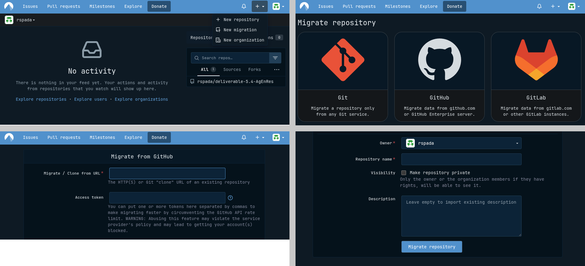

I have been using GitHub for while now. Both for collaboration and to host the code for my [reseach papers](/research.qmd) replication. GitHub is great, but recently they had a [few issues](https://mrshu.github.io/github-statuses/), probably caused by the huge volume created by automated workflow of AI agents. 

This is not a big deal for someone like me that uses source control just for research, but I see more and more people complaining about it, especially with how Microsoft handles the platform. Just try to type "GitHub" on YouTube.

There is also the issue of US and big tech in general. And let's ignore AI training without consent.  So I looked for alternatives. There are a few good ones, most notably [GitLab](https://gitlab.com/), that I am using with Wageningen University. But recently I found out about [Codeberg](https://codeberg.org/). 

## Why Codeberg?
Codeberg is an open source alternative to GitHub. It is **European** (based in Germany) and their mission is to provide a free, ethical, and non-commercial home for Free and Open Source Software (FOSS) projects. It is run by a non-profit organization, which is funded by [donations](https://donate.codeberg.org/).

Open source, European, and non-profit? What else can you ask for? 

This also aligns better with Open Science principles. If you also care about privacy, and ethics, I highly recommend to check it out. I mean if you are already committed to open science for your publications, why not apply the same principle to your infrastructure? You will have no problem switching if you are familiar with GitHub. The platform works almost exactly the same, such as creating new repositories or collaborating with others. You can also migrate your existing repositories from GitHub to Codeberg.

## How to migrate repositories
Migrating my repositories was pretty straightforward. If you also want to migrate follow these steps:

1. Create an account on Codeberg.
2. On the top right corner, click on the "+" icon and select "New migration".
3. Select "GitHub".
4. Copy and paste the URL of the GitHub repository you want to migrate.
5. Click on "Migrate repository", and you are done!

The original repository will stay intact. You can then decide to keep or delete it. 

## Conclusion
Switching to Codeberg is a small act. If you already publish open-access, share your data, and post replication code, then hosting that code on a non-profit, European, FOSS platform is a logical step. You are not giving anything up, repositories, collaboration, and CI work just as you would expect but you are opting out of the Microsoft ecosystem, and supporting a more ethical and open alternative.

You can find the code for my research replication on Codeberg [here](https://codeberg.org/rspada).
